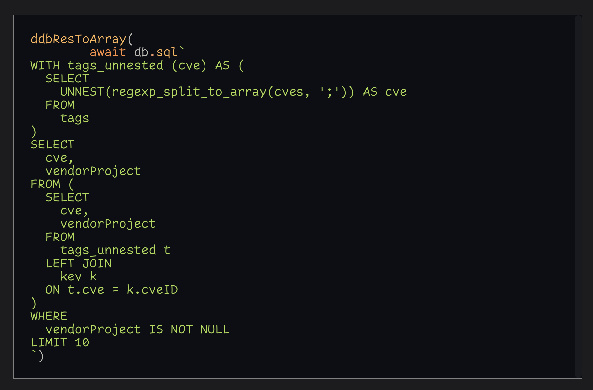

# 🧪 Vite + 🦆 DuckDB via Observable's Standard Library

## Not really a WebR Experiment, but we won't be using databases in WebR so we'll need other ways to get our data

Experiment parameters:

- Webr _(just to prove it can coexist)_
- New! Observable Standard Library's `DuckDBCLient`
- Lit (web components)
- Vite (for building)

Info is [here](https://rud.is/w/vite-duckdb/)

